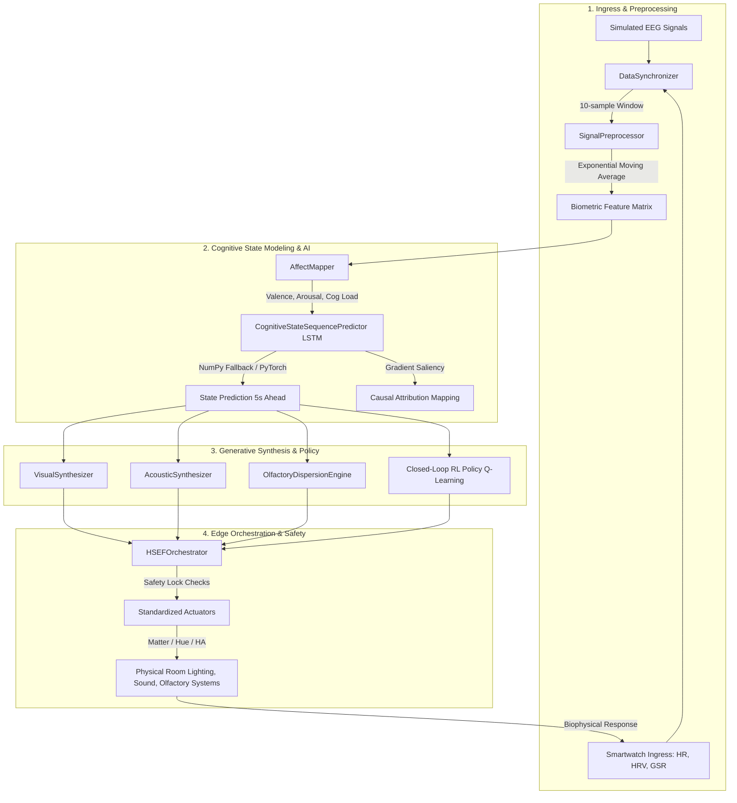

# Hyper-Personalized Sensory Environment Fabric (H-SEF)

An automated, closed-loop biophysical pipeline and intelligent control system that optimizes environmental lighting, sound, and olfactory parameters in real time based on user cognitive workload, stress levels, and affective states.

---

## 👤 Developer & Contact Information
* **Developer/Author**: Mohibul Hoque
* **Email**: [hokworks@gmail.com](mailto:hokworks@gmail.com)
* **LinkedIn**: [linkedin.com/in/speedymohibul](https://linkedin.com/in/speedymohibul)
* **GitHub Repository**: [speedyhok/Hyper-Personalized-Environmental-Fabric](https://github.com/speedyhok/Hyper-Personalized-Environmental-Fabric)

---

## 📐 System Architecture Diagram

The closed-loop architecture operates in a continuous real-time cycle:



---

## 🛠️ Detailed Component Walkthrough

### 1. Ingress and Data Processing (`h_sef/pipeline/`)
* **`stream.py` (Biometric Simulator)**: Simulates human physiology by generating synthetic EEG (alpha, beta, theta waves), Cardiovascular (Heart Rate, RMSSD HRV), and Electrodermal (GSR Tonic and Phasic) signals. It dynamically reacts to manual stressors injected from the dashboard (e.g., triggering high stress or calm).
* **`wearable_ingest.py` (Smartwatch Hub)**: Exposes a FastAPI endpoint `/api/wearable/ingest` allowing real-time telemetry ingestion from smartwatches, Apple Watches, or Fitbit devices.
* **`sync.py` (Data Synchronizer)**: Aligns high-frequency streams with low-frequency wearable data in real time, sliding a synchronized temporal window of 10 samples (representing the last 2 seconds of state).
* **`preprocess.py` (Signal Preprocessor)**: Filters high-frequency signal noise and prevents rapid actuator oscillations by applying an **Exponential Moving Average (EMA)** filter to the telemetry streams.

---

### 2. Affective Mapping (`h_sef/mappings/`)
* **`affect.py` (AffectMapper)**: Maps preprocessed biological signals to the Circumplex Model of Affect (Valence and Arousal) and computes a Cognitive Load index using established psychophysiological rules:
  * **Cognitive Load**: Calculated from the ratio of active/processing brain states to relaxation states:
    $$\text{Workload Ratio} = \frac{\theta + \beta}{\alpha}$$
    This is passed through a sigmoid function to produce a normalized score between `0.0` and `1.0`.
  * **Arousal**: Quantifies physiological excitement. It rises when Heart Rate exceeds baseline or when Phasic GSR spikes occur.
  * **Valence**: Measures emotional comfort. It correlates positively with HRV (RMSSD) and Alpha relative power, and receives a penalty during high-stress states (high arousal + low HRV).

---

### 3. AI Predictive Modeling (`h_sef/models/`)
* **`csm_core.py` (Cognitive State Modeling)**:
  * **LSTM Model**: A deep sequence model predicting future valence, arousal, and cognitive workload 5 seconds ahead. 
  * **Robust NumPy Fallbacks**: To ensure successful deployments on resource-constrained platforms (such as Render's Free Tier) and to handle incompatible Python runtimes (e.g., Python 3.14+), the model automatically bypasses PyTorch and routes calculations through a rule-based NumPy model when PyTorch is not installed (`HAS_TORCH = False`).
  * **Causal Attribution (Saliency)**: Calculates which categories (internal workload, environmental factors, or biometric physiology) are causing changes in user stress using backpropagation gradients (or standard feature importance ratios in the NumPy fallback).
* **`predictor.py` (Intervention Predictor)**: Uses a Scikit-Learn Ridge regression model to forecast the physiological benefit of potential room interventions (e.g., predicting stress reduction if the room temperature drops by $1.5^\circ\text{C}$).

---

### 4. Generative Synthesis (`h_sef/synthesis/`)
* **`generators.py` (Visual & Acoustic Synth)**:
  * **Visual (Lighting)**: Maps the user's focus and stress indices to optimal lighting. It follows the **Kruithof Curve** (ensuring comfortable lighting combinations of Lux and color temperature) and **Circadian Stimulus (CS)** guidelines:
    * **Warm Calming Glow (<4000K)**: Amber light `rgb(253,186,116)` for high-stress relief.
    * **Cool Focus Daylight (≥4000K)**: Ice blue-white light `rgb(186,230,253)` for concentration and alertness.
  * **Acoustic (Binaural Beats)**: Calculates carrier and entrainment frequencies dynamically:
    * **Gamma beats (38-42Hz)** are generated during high-focus states to enhance selective attention and memory.
    * **Alpha/Theta beats (6-10Hz)** are generated during high-stress states to reduce sympathetic nervous system tone.
* **`olfactory.py` (Olfactory Dispersion Engine)**: Models the physical dispersion of scent molecules in a room using wind speed, distance, and temperature parameters to calculate time-to-delivery and diffusion rates.

---

### 5. Control Policy and Actuators (`h_sef/synthesis/policy.py`)
* **Q-Learning RL Agent**: Discretizes the user's Valence, Arousal, and Cognitive Load into a 12-state space. Epsilon-greedy exploration selects actions (e.g., cooling the room, dimming the lights, changing binaural beats). The model receives rewards based on maximizing user valence and guiding arousal to target states:
  $$\text{Reward} = \text{Valence} - 0.7 \times |\text{Arousal} - \text{Target Arousal}| - 0.05 \times \text{Action Penalty}$$

---

### 6. Edge Orchestration and Safety (`h_sef/orchestrator.py` & `h_sef/actuators/`)
* **`orchestrator.py` (HSEFOrchestrator)**: Integrates all synthesis modules, runs the closed-loop control loop, and executes physical updates.
* **Safety Lock & Manual Overrides**: If a user manual intervention occurs, a safety lock blocks AI control for 30 seconds to prevent competing commands from confusing the user.
* **Physical Connectors (`h_sef/actuators/`)**: Contains standardized adapters for **Home Assistant**, **Philips Hue Bridge**, and custom **Matter-compatible** lights and climate systems.

---

## 🎨 Interactive 3D Room Dashboard (`static/`)

The dashboard incorporates a high-performance, real-time 3D sensory room visualizer built in **Three.js**:
* **Single Dynamic Light Source**: Utilizes exactly **one PointLight** (the ceiling pendant light) to illuminate the bedroom/office. 
* **Instantaneous Color Shifts**: The point light and pendant globe colors update instantly in sync with WebSocket state transitions to prevent any rendering lag.
* **Helical Scent Mist**: Simulates scent diffusion in the room using a helical particle system rising from a diffuser, changing color instantly based on the active scent (e.g., yellow for lemon, green for pine, purple for lavender).
* **Pulsing Sound Rings**: Renders expanding wave rings radiating from the desk monitor speakers to visually signal active binaural audio entrainment.

---

## 🚀 Getting Started

### Local Setup
1. Clone the repository:
   ```bash
   git clone https://github.com/speedyhok/Hyper-Personalized-Environmental-Fabric.git
   cd Hyper-Personalized-Environmental-Fabric
   ```
2. Install dependencies:
   ```bash
   pip install -r requirements.txt
   ```
3. Start the application:
   ```bash
   python run.py
   ```
4. Access the web dashboard at `http://127.0.0.1:8000`.

### Render Deployment Configuration
The repository includes a custom `render.yaml` blueprint and a `build.sh` script:
* **Recommended Python Version**: Set the environment variable `PYTHON_VERSION` to `3.10.12` or `3.11.5` in your Render Web Service settings to allow the installation of PyTorch.
* **Auto-Fallback**: If deployed on Render's Free Tier using default Python runtimes (e.g. Python 3.14.3+), the application automatically detects the missing PyTorch library and falls back to the high-performance NumPy pipeline, preventing deployment crashes.
